*June 18, 2018*

This is a lightning talk that I gave on May 31, 2018 at [CarpentryCon](http://carpentrycon.org) at University College Dublin. If you have any questions, please reach out via [Twitter](https://twitter.com/daniellequinn88) or [GitHub](https://github.com/DanielleQuinn)!

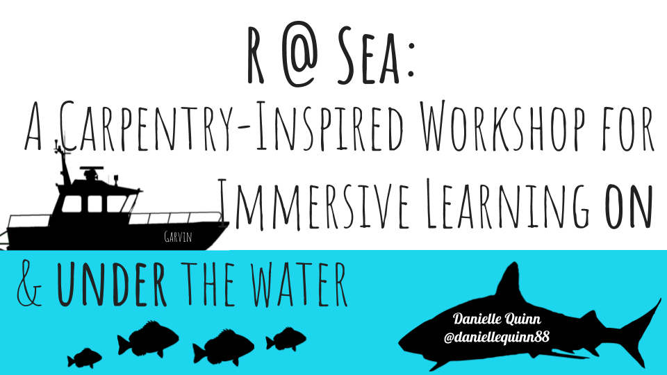

[Field School](http://www.getintothefield.com) is a Miami-based organization that provides hands-on training and practical research skills in marine science; experience that is critical for working in marine and environmental fields and for admission to graduate studies. Led by a team of wonderful humans including Dr. Catherine MacDonald, Dr. Julia Wester, Christian Pankow, Nick Perni, and Jake Jerome, Field School operates from a 55 foot marine research and dive vessel, the RV Garvin.

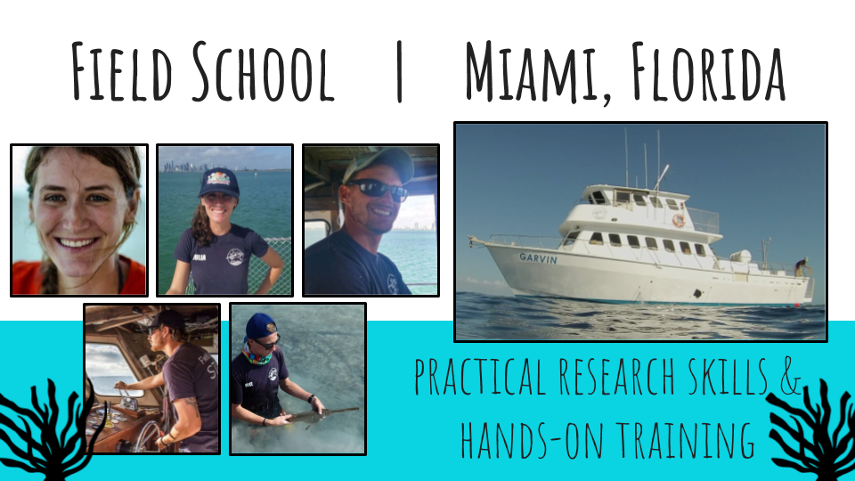

Some of their most popular courses include Marine Tropical Ecology, where students learn and practice everything from free diving to deploying underwater camera systems and Shark and Ray Handling, where students learn how to build and use a variety of fishing gear from scratch, and safely handle, measure, and tag pelagic sharks. Other courses include using RoVs, tracking Sperm Whales, and exploring the Dry Tortugas. Additionally, students get real world experience living and working on a research vessel, and transferable fisheries skills like navigation, boat safety, and knots. So, where does coding fit into this picture? Well, as we all know, collecting the data is not the end of a research project!

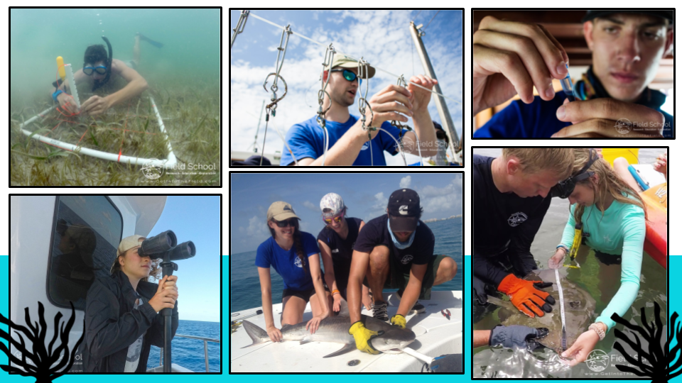

Ecologists and marine biologists are increasingly aware of the need for students and researchers to also be competent programmers and statisticians. Speaking to the Field School Directors, we agreed that these skill sets should be highlighted and offered in the same way as the more traditional marine science skills. The purpose of R at Sea was to emphasize the role and importance of coding and statistics in research skills and to provide an opportunity for students. Our hook was a novel twist on traditional coding courses. We targeted those students who knew they should learn ecological modelling techniques in R but were so called “fence sitters”, not yet ready to make the commitment.

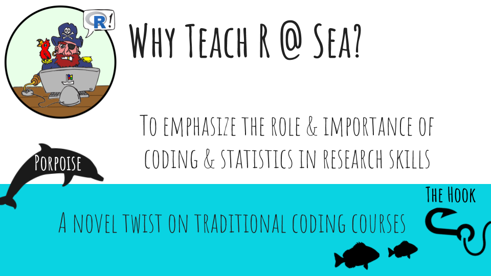

Not only did students live and learn aboard the RV Garvin, but intensive R sessions were broken up by activities like snorkeling, free-diving, and learning to identify local fish and coral species. So, what have I learned about offering this kind of course?

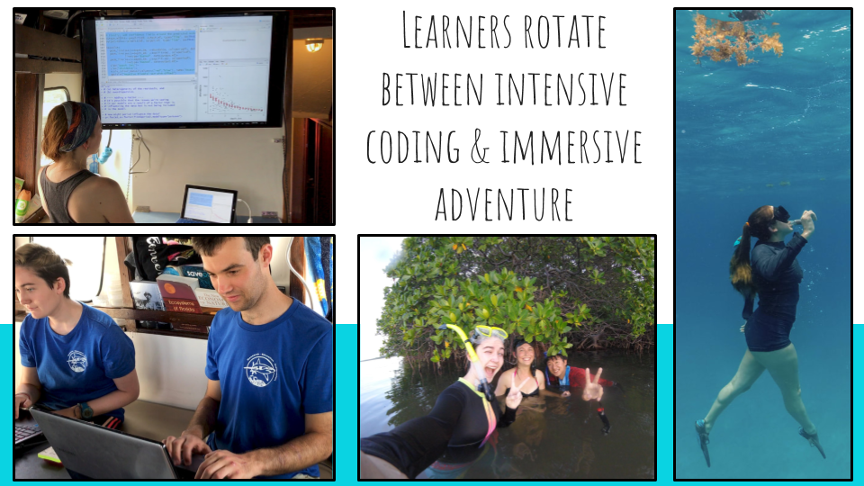

Non-traditional learning spaces can work - but they provide a unique set of challenges. Some of the Carpentries techniques, like sticky notes and pair programming become more important than ever because the space is difficult to move around in as an instructor.

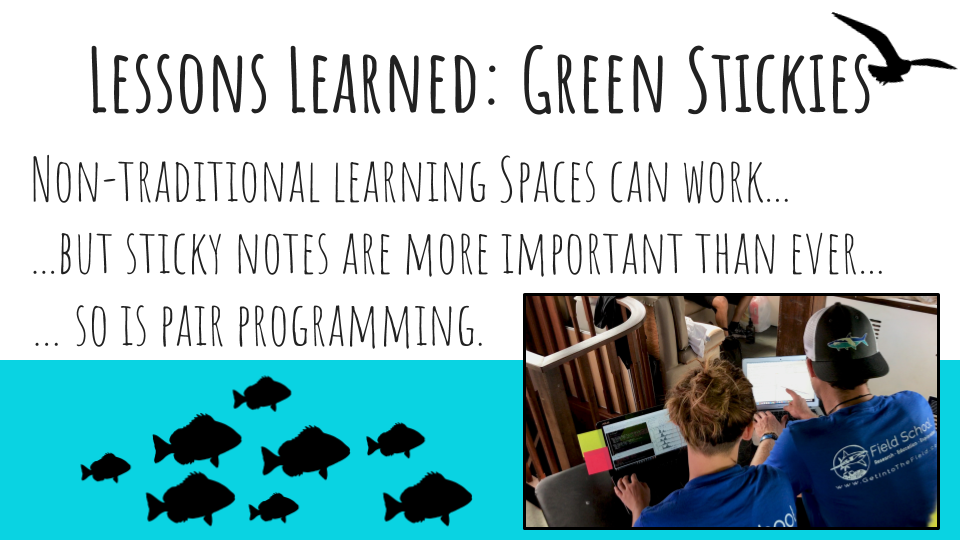

Casual, optional evening sessions WORK when everyone is in the same boat… figuratively, and in this case, literally. They lead to excitement, discussions, and cooperative coding as learners apply what they have learned to their own data sets and help each other troubleshoot their scripts.

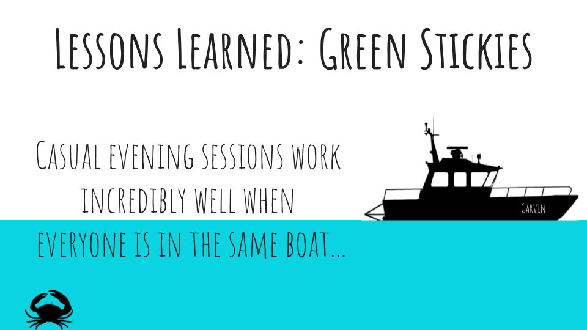

As you may imagine, trying to teach students statistics and coding at the same time leads to cognitive overload. To battle this, I use faded-example inspired code-alongs by providing fill-in-the-blank coding template that provides comments that help learners recognize patterns in modelling processes.

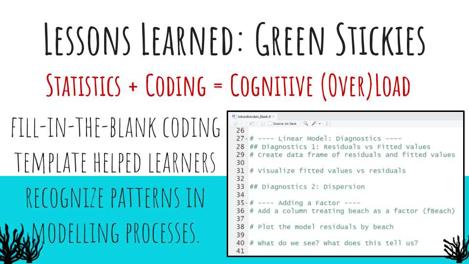

As I mentioned, we wanted to target those learners identified as "fence-sitters"; those that needed that extra convincing to take the plunge into coding. By offering a novel twist on a traditional coding course, we were able to draw them in! "Everything else" (the location, the research vessel, the adventure) is what some learners came for. What they took away, however, was how to code and a comprehensive introduction to ecological modelling.

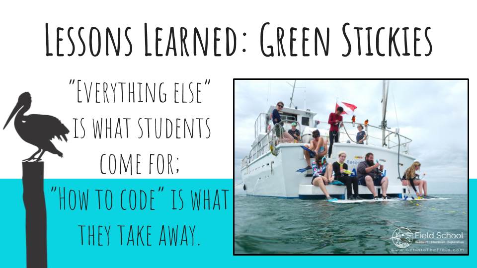

What will I do differently next time? Define modelling expectations: one aspect of the Carpentries lessons that I didn’t incorporate as much as I should have was establishing learning objectives and expectations. Because these students were novices to ecological modelling, their expectations reflected that, and were often variable, unclear, or hindered by misconceptions. Coworking sessions, as mentioned, were extremely successful; in the future I’ll allocate more time for this! No internet (or unreliable internet): make sure you have everything your students will need on flash drives. This includes all of the software, packages, and data compatible with each operating system. The sun can drain your energy! Plan your activities and breaks accordingly.. Seasickness impedes coding - ginger gravol (anti-nausea medication) should be added to the to-bring list..

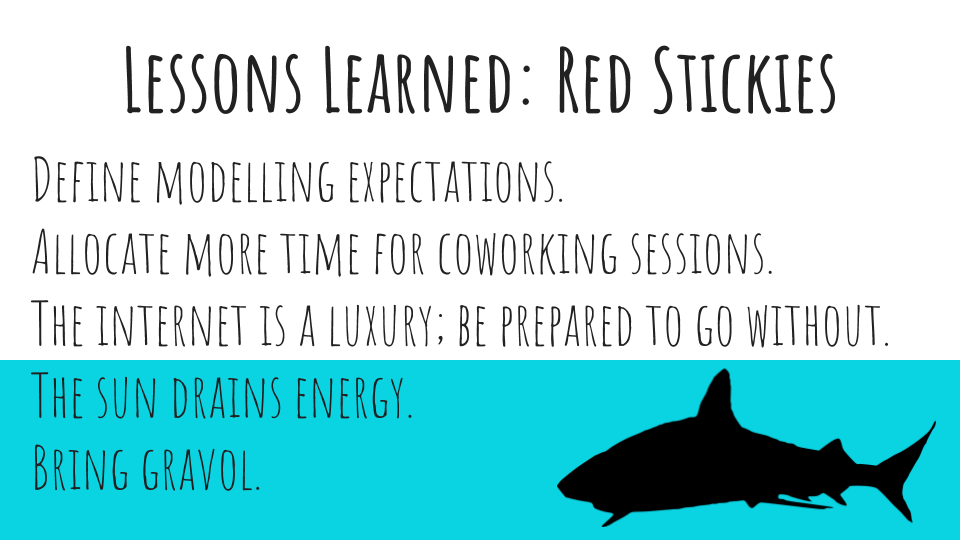

I think that these sort of “coding retreats” have the potential to be a valuable resources for learners. We recently announced our next round of R at Sea, which will be happening September 1-3, 2018; if you or anyone you know might be interested in becoming a student with Field School, check out the website and / or contact me at danielle.quinn@mun.ca!

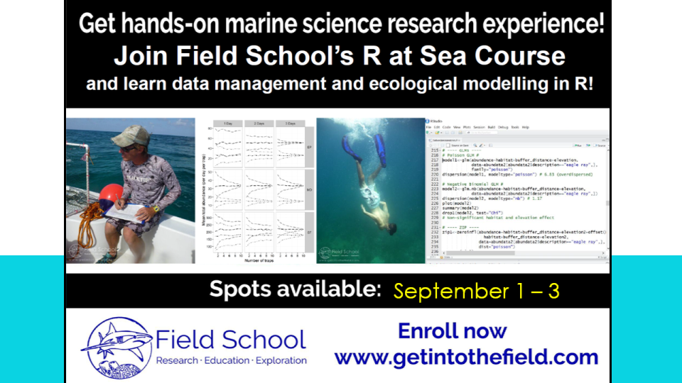
