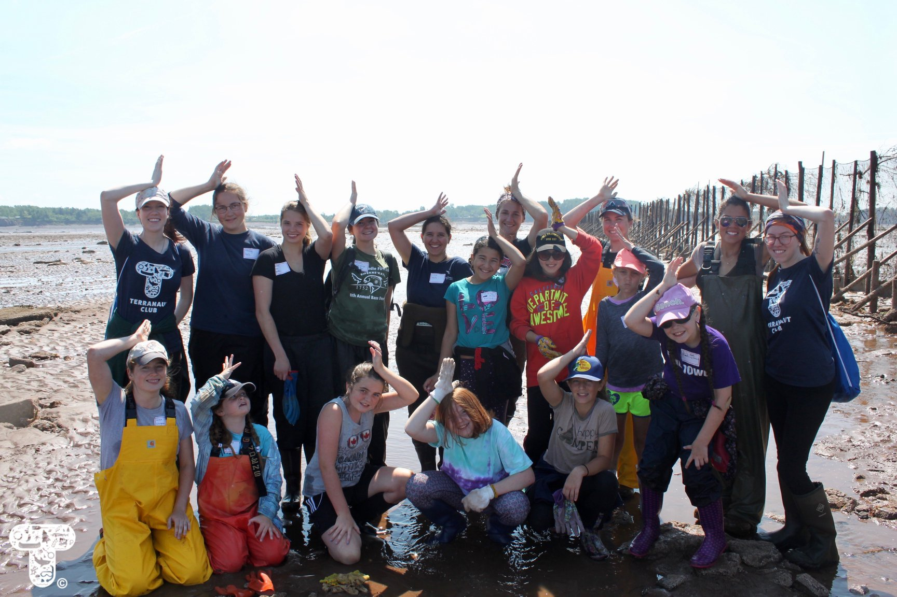
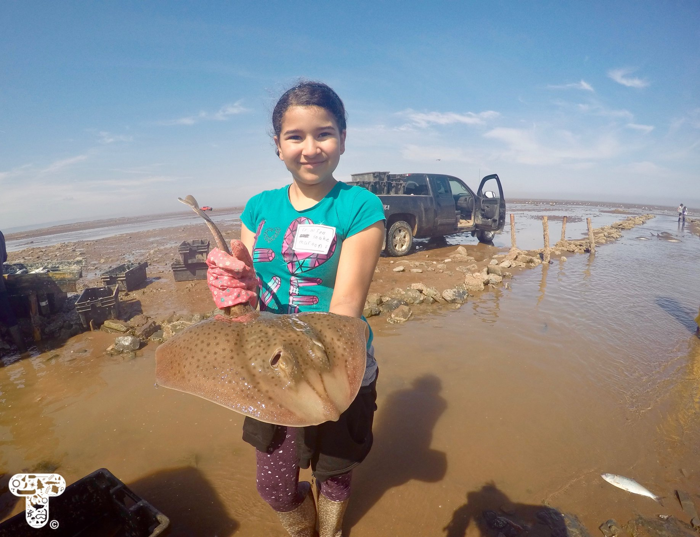
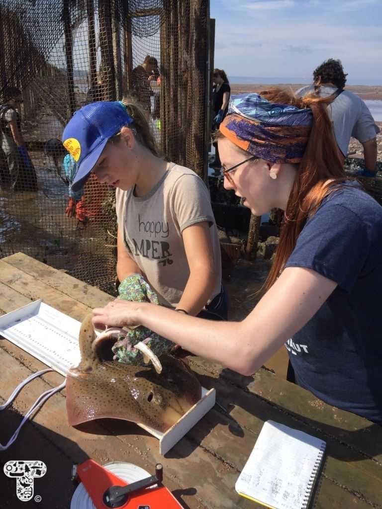
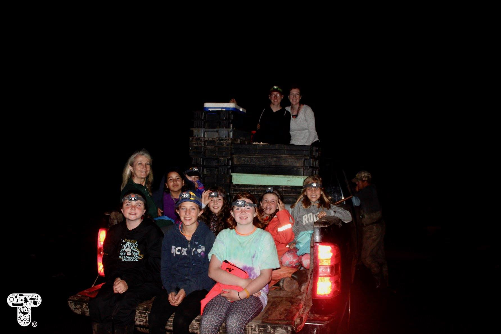
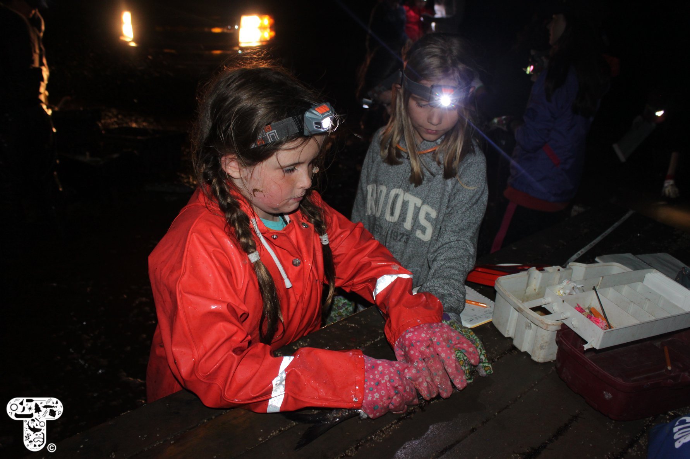
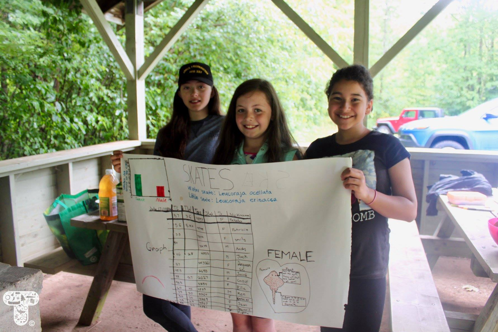

### Terranaut Junior Marine Biologist Program

*August 6, 2018*

We are **thrilled** to share photos from our [Terranaut Club](https://terranautclub.com/) Junior Marine Biologist program that ran July 17 - 18 in Hants County, Nova Scotia with eight 9-12 year old girls.

This 1.5 day program was absolutely jam-packed. We started out with an early morning at the Porter commercial intertidal weir, assisting female biologists from [Acadia University](https://www2.acadiau.ca/index.php) with their conservation research on Atlantic sturgeon, little skate, and winter skate. We then traveled to Smiley's Provincial Park, where girls learned how to set up a tent, followed by a group discussion and activities about marine pollution, oil spills, and reducing our consumption of single-use plastics. We painted reusable Terranaut Club bags, did an engineering activity where the girls designed and built miniature boats and tested their load-bearing capabilities, and enjoyed the beautiful day.

Later that evening, we traveled BACK to the Porter weir for a tide of conservation research in total darkness! Girls were equipped with Glo-sticks and headlamps, and had a blast exploring the ocean floor at night. Back at camp, we made it through the night in our tents despite torrential rain (go girls!), and finished off the program the next morning with a squid dissection, discussion of local shark species. Parents arrived just in time to hear the girls present their handmade posters about their favourite species and research efforts at the weir. It's safe to say that everyone, including the instructors, slept very well the following night!

This program was a definite success, and the girls were incredible. They were enthusiastic (even at midnight!), brave (despite the slime!), and impressively well-aware of environmental issues. They also lucked out during at the weir, seeing a total of 10 sturgeon (some 6 feet long!), over 25 other species of marine creatures, and meeting seven young female biologists from Acadia University.

**Thank you** to all of our volunteers for this event, including photographer Lydia Broderick, helper Donna Young, fisherwoman and weir owner Erica Danae Porter, cinematographer Jerry Lockett, behind-the-scenes helpers Emma Carmichael and Christine Mc, the biologists Jessie, Anna, Maddie, Rachel, Kelsey, Maja, Liza, and Jacskon, and Instructors Julia Whidden and Danielle Quinn.

Another sincere thank you also goes out to the sponsors of this program: McCallum Environmental, the Canadian Federation of University Women Wolfville Chapter, and Annapolis Cider Company. This truly wouldn't have been possible without your support!

To see all of the photos from this program, check us out on [Facebook](https://www.facebook.com/pg/terranautclub/photos/?tab=album&album_id=949305258589576)!
