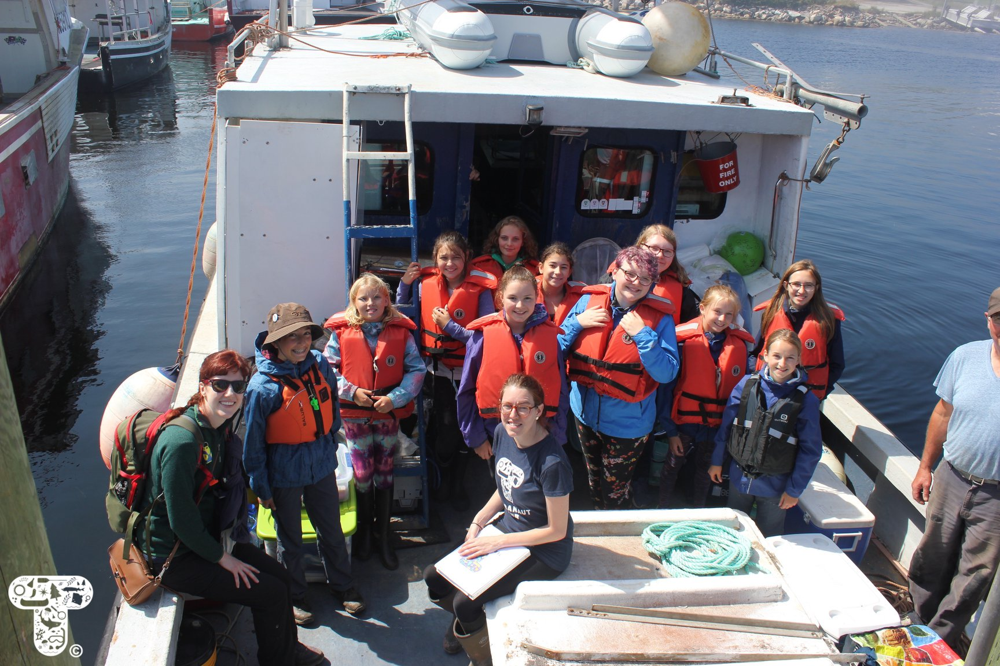
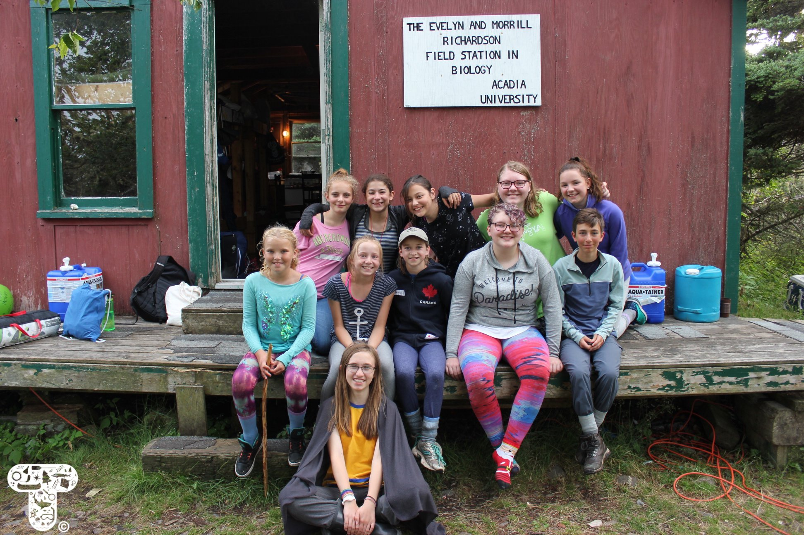
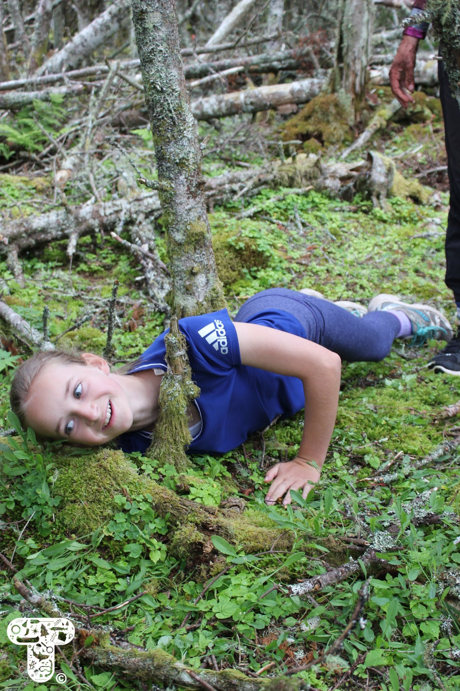
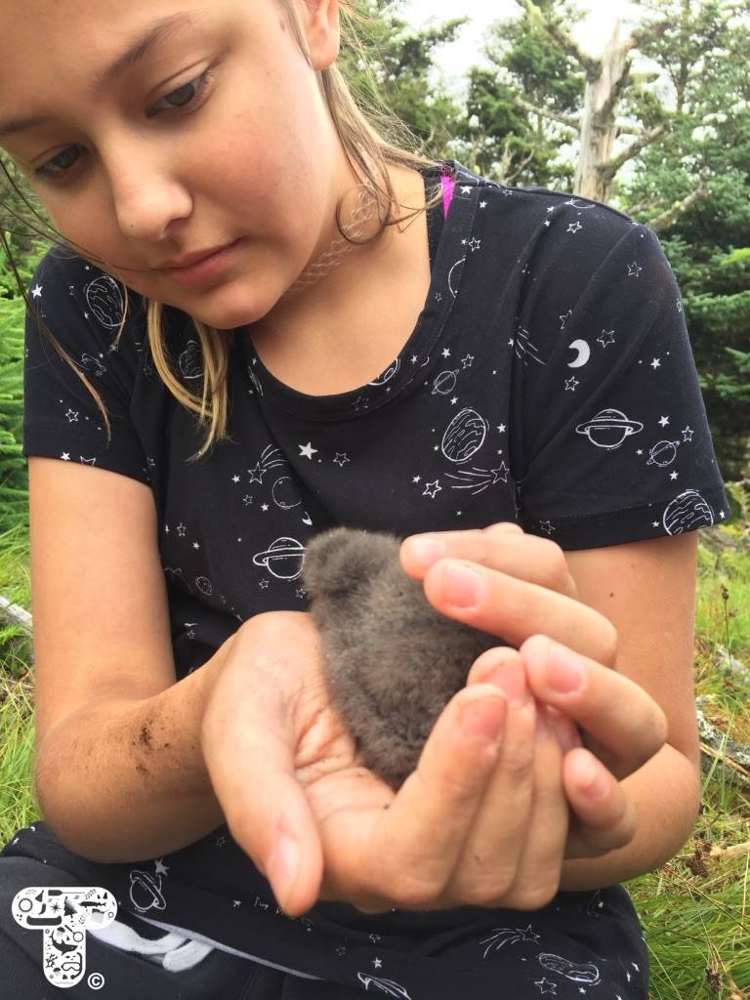
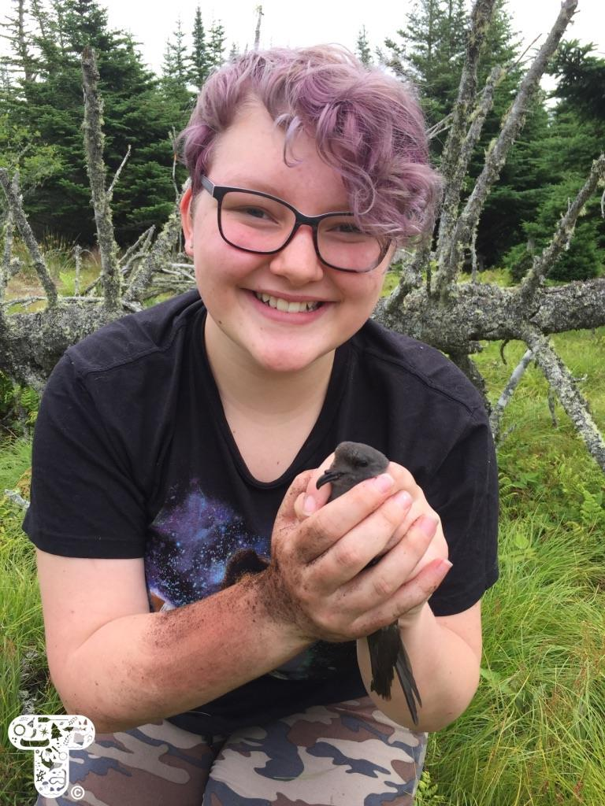
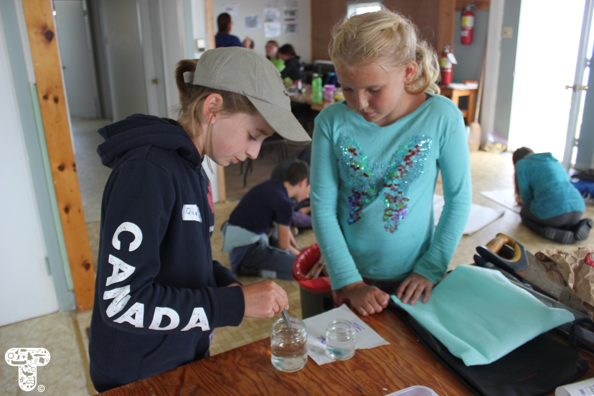
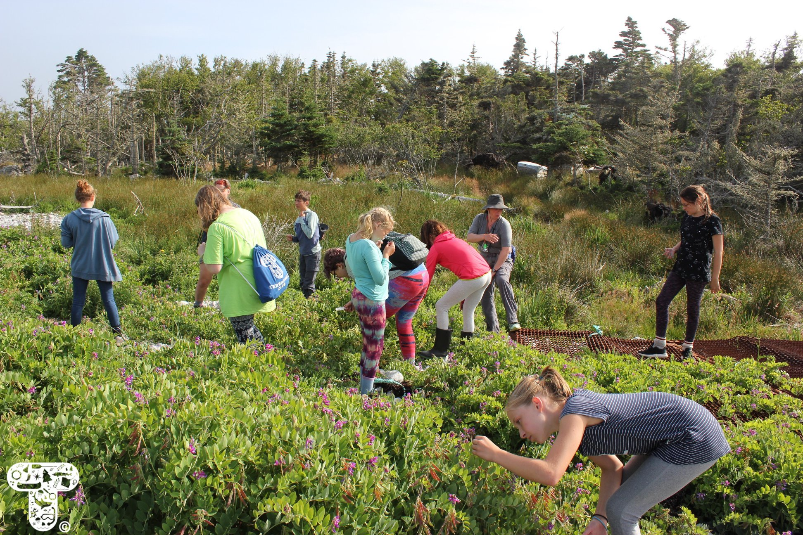
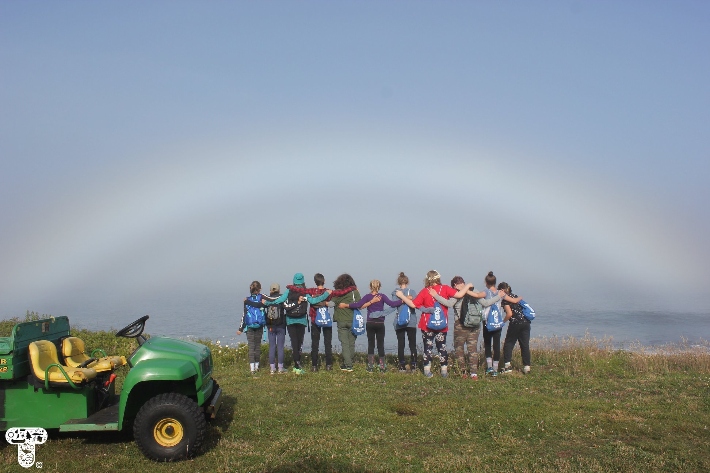

### Terranaut Club Junior Wildlife COnservation Program 2018

*August 7, 2018*

From July 20th to 23rd, [Terranaut Club](https://terranautclub.com/) hosted eleven 11-14 year old girls on Bon Portage Island, Nova Scotia, for our first Junior Wildlife Conservation Program!

Bon Portage Island is a research station owned in part by [Acadia University](https://www2.acadiau.ca/index.php) that is home to an estimated 50,000 breeding pairs of [Leach's storm petrel](https://www.audubon.org/field-guide/bird/leachs-storm-petrel), a small grey seabird. Leach's storm petrel populations have faced significant declines, which is why there is ongoing research to study and monitor this population on the island. We thought that Bon Portage (BP) would be the perfect place to learn about wildlife conservation in a hands-on way, and we were right!

We started off our weekend by meeting the island's female biologists and Acadia students, Rielle and Casi. Over the next 2.5 days, our all-female crew of Biologists and Instructors engaged the girls in all sorts of activities and discussions about wildlife conservation. These jam-packed days included hiking the island, talking about which species get conserved and why, learning about storm petrel research and wildlife harassment, learning to grub for storm petrel adults and chicks (SO SOFT!), doing a squid dissection, talking about marine pollution and how to reduce our consumption of single-use plastics, chemically testing microplastic fragments we found around the island, setting fish traps in the saltwater pond and measuring and releasing the hundreds of mummichog we caught, doing an engineering activity, learning about the island's edible plants with naturalist Char, nature connectivity exercises with naturalist Marina, and independently exploring the island. We still can't believe that we fit it all in! It was an amazing weekend all-around, and we truly couldn't have asked for a better first group of girls to have out there!

We HAVE to thank all of the amazing people that contributed to this program, including Biologists Rielle Hoeg and Casi Sutherland, Environmental Educators/Naturalists/Biologists Marina Myra and Char Bishop, Instructors Danielle Quinn and Julia Whidden, photographer Jenny Morse, boat Captain Gary, island Director Phil Taylor, behind-the-scenes help Emma Carmichael and Christine Mc, and last but certainly not least: our sponsors. Another invaluable thank you to the groups that financially supported this program: Blomidon Naturalists Society, Annapolis Cider Company, Equilibrium Engineering, and CBCL Limited.

We can't wait to run this program again next year!

To see all of the photos from this program, check us out on [Facebook](https://www.facebook.com/pg/terranautclub/photos/?tab=album&album_id=956672694519499)!
